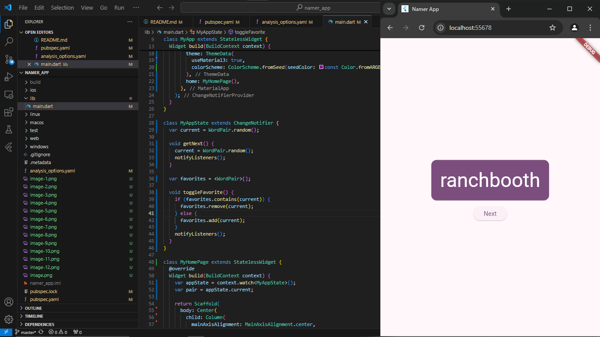
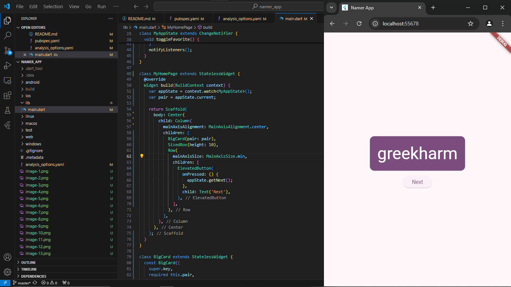

# Capture Hasil Praktikum

## Menambahkan tombol

### Meluncurkan aplikasi

### Hot Reload Pertama

### Menambahkan tombol

### Perilaku pertama Anda

## Memperindah tampilan aplikasi

### Mengekstrak widget

### Menambahkan Kartu

### Tema dan gaya

### TextTheme

### Meningkatkan aksesibilitas

### Menempatkan UI di tengah

## Menambahkan fungsi

### Menambahkan logika bisnis

### Menambahkan tombol

## Menambahkan kolom samping navigasi

### Widget stateless versus stateful

### setState

### Menggunakan selectedIndex

### Tingkat respons

## Menambahkan halaman baru

